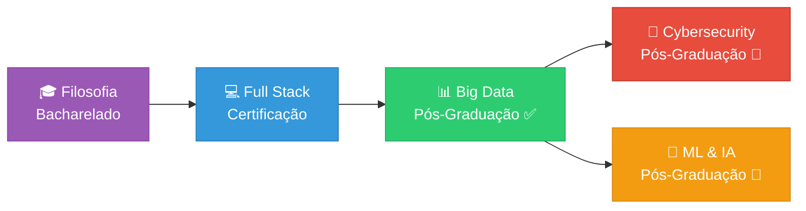

# 👋 Olá! Eu sou Mariana Carminate

### 🧠 Filósofa | 💻 Full Stack Developer | 📊 Big Data Specialist | 🤖 ML Engineer | 🔐 Cybersecurity

**"Do pensamento crítico à inteligência artificial segura"** 🧠🔐🤖

---

## 🚀 Sobre Mim

Sou uma **desenvolvedora multidisciplinar** com uma combinação única de habilidades que vai desde Filosofia até Machine Learning e Cibersegurança.

### 🎓 Educação
- 🧠 Bacharelado em **Filosofia**
- 📊 Pós-Graduação em **Big Data** ✅
- 🔐 Pós-Graduação em **Cibersegurança** 🔄
- 🤖 Pós-Graduação em **ML & IA** 🔄
- 💻 Certificação **Full Stack Developer** ✅

### 💡 O Que Me Diferencia

**Filosofia** me ensinou a:
- Pensar criticamente sobre problemas complexos
- Questionar pressupostos em algoritmos
- Desenvolver IA com consciência ética
- Comunicar ideias técnicas com clareza

**Tech** me permite:
- Construir sistemas completos (Full Stack)
- Processar dados em escala (Big Data)
- Criar modelos inteligentes (ML/AI)
- Proteger o que construo (Cybersecurity)

### 🎯 Resultado
> Sistemas de IA completos, seguros, escaláveis e éticos

**Atualmente focada em:** MLOps • Secure AI • Big Data ML • Explainable AI

---

## 🎓 Formação & Especialização

| 🎯 Área | Status | Instituição |
|---------|--------|-------------|
| 🎓 Filosofia | ✅ Concluído | [Nome da Universidade] |
| 📊 Big Data | ✅ Concluído | [Nome da Instituição] |
| 💻 Full Stack | ✅ Concluído | [Nome da Instituição] |
| 🔐 Cibersegurança | 🔄 Em Andamento | [Nome da Instituição] |
| 🤖 ML & IA | 🔄 Em Andamento | [Nome da Instituição] |

---

## 🛠️ Tech Stack Completo

### 💻 Full Stack Development

### 📊 Big Data & Analytics

### 🤖 Machine Learning & AI

### 🔐 Cybersecurity & Tools

---

## 🌟 Projetos em Destaque

### 🌸 [Classificador de Flores - Transfer Learning](https://github.com/maricarminate/classificador-flores)

Sistema completo de classificação de 5 tipos de flores usando **Transfer Learning** com MobileNetV2

**Destaques:**
- ✅ **Acurácia:** 92%+ no conjunto de validação
- ✅ **Transfer Learning:** MobileNetV2 pré-treinado no ImageNet
- ✅ **Dataset:** ~4300 imagens organizadas e limpas
- ✅ **Features:** Data augmentation, callbacks inteligentes, visualizações profissionais
- ✅ **Documentação:** README completo com instruções passo a passo

**Tech:** Python • TensorFlow • Keras • Computer Vision • Transfer Learning • Data Augmentation

---

### 🐱 [Classificador de Gatos e Cachorros - CNN](https://github.com/maricarminate/classificador-animais)

Rede Neural Convolucional do zero para classificação binária

**Destaques:**
- ✅ **Dataset:** 25.000 imagens do Kaggle
- ✅ **Arquitetura:** CNN com 4 camadas convolucionais
- ✅ **Acurácia:** 85%+
- ✅ **Pipeline completo:** Preparação, treinamento, avaliação e teste

**Tech:** Python • TensorFlow • Keras • CNNs • Deep Learning • Image Classification

---

### 🚀 [Mais Projetos em Breve...]

Atualmente trabalhando em:
- 📊 Pipeline de Big Data para ML
- 🔐 Aplicação Full Stack com segurança integrada
- 🤖 Sistema de ML explicável e transparente

---

## 📊 GitHub Stats

---

## 💡 Por Que Filosofia + Tech?

<table>
<tr>
<td width="50%">

### 🧠 Filosofia Traz

- ✅ Pensamento crítico
- ✅ Análise de argumentos
- ✅ Ética e responsabilidade
- ✅ Identificação de vieses
- ✅ Comunicação clara

</td>
<td width="50%">

### 💻 Aplicação em Tech

- → Questiona pressupostos em algoritmos
- → IA responsável e consciente
- → Debugging e arquitetura
- → Bias detection em ML
- → Documentação excelente

</td>
</tr>
</table>

---

## 🎯 Áreas de Interesse

<table>
<tr>
<td width="33%" valign="top">

### 🔥 Foco Atual
- 🚀 MLOps & Model Deployment
- 🔐 Secure AI Systems
- 📊 Scalable ML Pipelines
- 🔍 Explainable AI
- 💾 Big Data ML Integration

</td>
<td width="33%" valign="top">

### 🌱 Explorando
- 🎨 Generative AI
- 🤖 LLMs & Fine-tuning
- 🌐 Federated Learning
- 🛡️ AI Safety & Alignment
- ☁️ Cloud ML (AWS/GCP)

</td>
<td width="33%" valign="top">

### ❤️ Paixões
- ⚖️ AI Ethics
- 🔒 Data Privacy
- 🌍 Responsible Tech
- 💚 Tech for Good
- 🧠 Philosophy of AI

</td>
</tr>
</table>

---

## 📚 Atualmente Estudando

- 🔐 **Cybersecurity**: DevSecOps, Application Security, OWASP
- 🤖 **ML/AI Avançado**: Deep Learning, MLOps, Model Optimization
- ☁️ **Cloud Computing**: AWS, GCP, Azure ML
- 🚀 **Generative AI**: LangChain, Vector Databases, RAG

---

## 🏆 Conquistas & Certificações

| 🎯 Conquista | Status | Ano |
|--------------|--------|-----|
| 🎓 Bacharelado em Filosofia | ✅ | 2021 |
| 📊 Pós-Graduação Big Data | ✅ | 2025 |
| 💻 Certificação Full Stack | ✅ | 2025 |
| 🔐 Pós Cibersegurança | 🔄 | 2025 |
| 🤖 Pós ML & IA | 🔄 | 2025 |

---

## 💼 Habilidades Complementares

### 🧠 Soft Skills (da Filosofia)

- 🎯 **Pensamento Crítico** - Análise profunda de problemas complexos
- 📖 **Comunicação** - Explicação clara de conceitos técnicos
- ⚖️ **Ética** - Desenvolvimento responsável de IA
- 🔍 **Pesquisa** - Investigação metodológica de soluções
- 🤝 **Colaboração** - Trabalho em equipe multidisciplinar

### 💻 Hard Skills

- ⭐ **Full Stack Development** - Frontend + Backend + Database
- ⭐ **Big Data Engineering** - Hadoop + Spark + ETL Pipelines
- ⭐ **Machine Learning** - Supervised + Unsupervised + Deep Learning
- ⭐ **Computer Vision** - CNNs + Transfer Learning + Object Detection
- ⭐ **MLOps** - Model Deployment + Monitoring + CI/CD

---

## 🌍 Contribuições Open Source

<picture>
  <source media="(prefers-color-scheme: dark)" srcset="https://raw.githubusercontent.com/seu-usuario/seu-usuario/output/github-snake-dark.svg">
  <source media="(prefers-color-scheme: light)" srcset="https://raw.githubusercontent.com/seu-usuario/seu-usuario/output/github-snake.svg">
  
</picture>

### 📈 Mais Estatísticas

---

## 📫 Vamos Conectar!

Interessado(a) em conversar sobre:

🤖 **Machine Learning & AI** • 📊 **Big Data** • 🔐 **Cybersecurity** • 💻 **Full Stack**  
🧠 **AI Ethics** • 🌍 **Tech for Good** • 📚 **Filosofia da Tecnologia**

 

---

### 💭 Filosofia de Trabalho

> *"Construo tecnologia que questiona, aprende, protege e respeita.  
> Do pensamento crítico à inteligência artificial responsável."*

---

### ⭐ Se meus projetos te ajudaram, considere dar uma estrela!

**Obrigada por visitar meu perfil!** 🌸

---

*Última atualização: Janeiro 2025* 🚀

